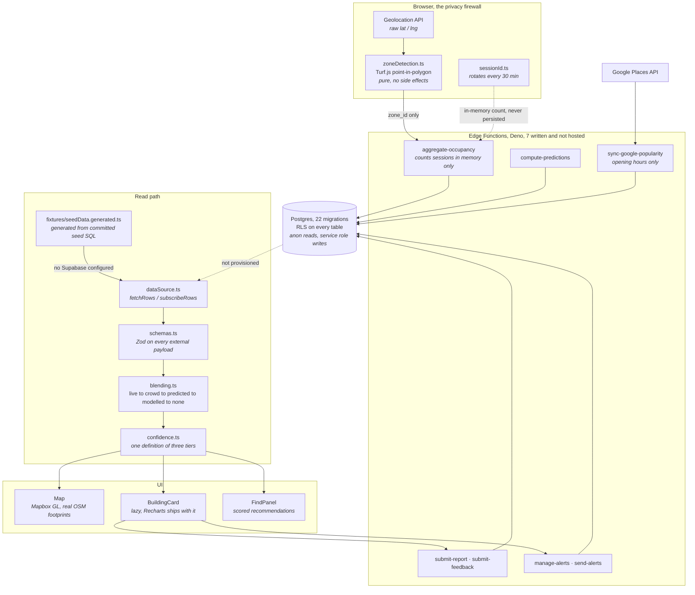

# System Architecture

**A Vite and React 19 single-page PWA that reads through one seam, so it runs identically
against Postgres or against fixtures generated from the committed seed SQL.** The Deno Edge
Functions and the 22-migration Postgres schema are committed and reviewable. Neither is hosted.

Diagram reproduced from `README.md` § Architecture, verified against `src/lib/` on disk.

## The two shaping decisions

**Zone matching happens on the client.** The moment a raw coordinate reaches a server, "we never
see where you are" becomes a claim about server-side behaviour that nobody outside the project
can check. So the point-in-polygon test was pushed into a pure function on the device and the
wire format reduced to a zone identifier, which is a promise a stranger can verify by opening
the network tab.

**Every hook reads through one seam.** `src/lib/dataSource.ts` exposes `fetchRows` and
`subscribeRows`, and nothing above it knows whether the rows came from Postgres or from a local
fixture. It was introduced to make the app runnable without a backend. The payoff turned out to
be larger: the fixtures are generated from the same committed seed SQL a real database would be
seeded from, a test fails if the two fall out of step, and the integration suite runs the whole
read path across 18 buildings with no network at all.

## There is no backend, and that is a decision

**No Supabase project is provisioned, and none will be.** Hosted Postgres, Realtime and Edge
Functions cost money every month, and this is a portfolio project. The backend is deliberately
parked, not pending.

| Committed and reviewable | Running |
|---|---|
| **22** SQL migrations, applied in order, RLS on every table | none |
| **8** seed files: 18 buildings, 47 zones, 890 rooms, 1,156 occupancy rows | none |
| **7** Deno Edge Functions | none |
| The React client and its **388**-test suite | deployed to Vercel |

The honest consequence: **the live-crowdsourced path has never run against real users.** Its
code is written and unit-tested, and the app falls through to estimates when it returns nothing,
which today is always. Pointing `dataSource.ts` at a live project is an environment-variable
change, not a rewrite.

## Stack

`typescript` · `react@19` · `vite@8` · `react-router-dom@7` · `tailwindcss@4` ·
`mapbox-gl@3` · `@turf/turf@7` · `zod@4` · `recharts@3` · `framer-motion@12` ·
`@radix-ui/react-slider` · `@radix-ui/react-switch` · `@supabase/supabase-js@2` ·
`vite-plugin-pwa` · `vitest@4` · Deno for Edge Functions · Postgres via Supabase · Vercel.

Package manager is **pnpm 11.13.0**, pinned in `package.json` and in CI.

## Related

[[(Note) The Privacy Firewall]] · [[(Note) The src Tree]] · [[(Note) Data Model]] ·
[[(Note) The Four Load-Bearing Decisions]] · [[(Index) 10 Architecture]]
